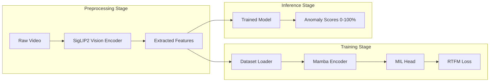

# SigMamba-V1: Unified Video Anomaly Detection using SigLIP 2 and Mamba SSM

<p align="center">
  
  
  <a href="https://huggingface.co/collections/VINAY-UMRETHE/sigmamba-inventory"></a>
</p>

> **Weakly Supervised Video Anomaly Detection using SigLIP 2 and Mamba SSM**

A unified architecture that combines **SigLIP 2** (Google's SOTA vision encoder) with **Mamba** (Linear-complexity State Space Model) for detecting anomalies in surveillance videos. The system achieves linear O(N) scaling, enabling processing of long-form video content that was previously impractical with quadratic-cost Transformers.

> [!NOTE]
> SigLIP2 is a vision encoder model which is transformers based. So it has $O(N^2)$ complexity.

---

# Model Comparison

> [!TIP]
> **Which version should I use?**
> - **SigMamba-V1-Large:** Best for complex visual reasoning and maximum performance.
> - **SigMamba-V1-Small:** Best for speed and lower memory usage.

### Benchmark

| Metric | V1 (Large) | V1 (Small) |
| :--- | :--- | :--- |
| **AUC-ROC** | **89.82%** | 87.57% |
| **Average Precision** | **41.05%** | 32.04% |
| **Best F1-Score** | 41.18% | **41.90%** |
| **Inference FPS** | 1,022 | **3,242** |
| **Peak VRAM** | 5,148 MB | **3,207 MB** |

---

## Key Features

- **Linear Complexity**: $O(N)$ scaling via Mamba SSM (vs $O(N^2)$ for Transformers)
- **Dual Input Modes**: Accepts raw pixels or pre-extracted features

---

## Architecture

The model operates in two modes:

| Mode | Input | Use Case |
|------|-------|----------|
| **Unified** | `pixel_values` (B, T, 3, 384, 384) | End-to-end inference |
| **Modular** | `features` (B, T, 1024) | Training / batch processing |

---

**The architecture achieves linear computational complexity $O(N)$ with respect to sequence length, enabling real-time processing of long surveillance videos while maintaining high detection accuracy.**



---

## Hyperparameters

### Large

| Parameter | Value | Description |
|-----------|-------|-------------|
| Feature Dim | 1024 | SigLIP output dimension |
| Mamba d_model | 768 | Internal hidden dimension |
| Mamba Depth | 8 | Number of stacked layers |

## Small

| Parameter | Value | Description |
|-----------|-------|-------------|
| Feature Dim | 768 | SigLIP output dimension |
| Mamba d_model | 768 | Internal hidden dimension |
| Mamba Depth | 8 | Number of stacked layers |

**SigMamba:** The Mamba model is ~32M parameters.

---

## Usage
#### Prerequisites
```bash
pip install opencv-python
pip install transformers==4.57.3
```
> [!TIP]
> It's recommended to use `num_frames=32` due to model's training.

### Loading the Model

```python
from transformers import AutoModel, AutoProcessor
import torch
model = AutoModel.from_pretrained(
    "VINAY-UMRETHE/SigMamba-V1-Large",
    trust_remote_code=True
)
device = torch.device("cuda" if torch.cuda.is_available() else "cpu")
model = model.to(device)
model.eval()
processor = AutoProcessor.from_pretrained(model.config.vision_model_id)
```

---

## Inference Mode 1: Unified (Raw Pixels → Scores)

Use this when you have raw video files. The model handles feature extraction internally.

### Example: Single Video

```python
import cv2
import numpy as np
def load_video_frames(video_path, num_frames=32):
    """Sample frames uniformly from a video."""
    cap = cv2.VideoCapture(video_path)
    total_frames = int(cap.get(cv2.CAP_PROP_FRAME_COUNT))
    indices = np.linspace(0, total_frames - 1, num_frames, dtype=int)
    
    frames = []
    for idx in indices:
        cap.set(cv2.CAP_PROP_POS_FRAMES, idx)
        ret, frame = cap.read()
        if ret:
            frame = cv2.cvtColor(frame, cv2.COLOR_BGR2RGB)
            frames.append(frame)
    cap.release()
    return frames
frames = load_video_frames("test_video.mp4", num_frames=32)
inputs = processor(images=frames, return_tensors="pt")
pixel_values = inputs.pixel_values.to(device)
pixel_values = pixel_values.unsqueeze(0)
# Inference.
with torch.no_grad():
    scores = model(pixel_values=pixel_values)
# Get results.
anomaly_scores = scores.squeeze().cpu().numpy()
max_score = anomaly_scores.max()
print(f"Max Anomaly Score: {max_score:.4f}")
```

## Inference Mode 2: Modular (Pre-Extracted Features → Scores)

Use this when you've already extracted features for Training the model.

### Example: From Feature File

```python
def load_features_from_txt(feature_path):
    """Load features from text file (one line per segment)."""
    with open(feature_path, 'r') as f:
        lines = f.readlines()
    features = []
    for line in lines:
        values = [float(v) for v in line.strip().split()]
        features.append(values)
    return torch.tensor(features, dtype=torch.float32)
# Load features.
features = load_features_from_txt("video_features.txt")
features = features.unsqueeze(0).to(device)
# Inference.
with torch.no_grad():
    scores = model(features=features)
print(f"Anomaly Scores: {scores.squeeze().cpu().numpy()}")
```

## Batch Processing Multiple Videos

Process multiple videos in a single forward pass for efficiency.

```python
# Load multiple videos.
video_paths = ["video1.mp4", "video2.mp4", "video3.mp4"]
batch_frames = []
for path in video_paths:
    frames = load_video_frames(path, num_frames=32)
    inputs = processor(images=frames, return_tensors="pt")
    batch_frames.append(inputs.pixel_values)
pixel_values = torch.stack(batch_frames).to(device)
with torch.no_grad():
    scores = model(pixel_values=pixel_values)
for i, path in enumerate(video_paths):
    max_score = scores[i].max().item()
    print(f"{path}: {max_score:.4f}")
```

## Single Frame

For individual frames.

```python
from PIL import Image
# Load single image.
image = Image.open("suspicious_frame.jpg")
inputs = processor(images=image, return_tensors="pt")
pixel_values = inputs.pixel_values.to(device)
pixel_values = pixel_values.unsqueeze(0)
with torch.no_grad():
    score = model(pixel_values=pixel_values)
    print(f"Frame Anomaly Score: {score.item():.4f}")
```

## Extract Features Only (No Classification)

Access the Mamba encoder output directly for custom downstream tasks.

```python
# Load frames.
frames = load_video_frames("video.mp4", num_frames=32)
inputs = processor(images=frames, return_tensors="pt")
pixel_values = inputs.pixel_values.unsqueeze(0).to(device)
# Access internal components.
with torch.no_grad():
    # Step 1: Extract vision features.
    b, t, c, h, w = pixel_values.shape
    flat_pixels = pixel_values.view(b * t, c, h, w)
    vision_features = model.vision_model.get_image_features(pixel_values=flat_pixels)
    vision_features = vision_features / vision_features.norm(dim=-1, keepdim=True)
    vision_features = vision_features.view(b, t, -1)
    
    # Step 2: Get Mamba-encoded features.
    mamba_features = model.mamba_encoder(vision_features)
    
    print(f"Vision Features: {vision_features.shape}")
    print(f"Mamba Features: {mamba_features.shape}")
```

## Threshold-Based Detection 

Apply a threshold to convert scores into binary predictions.

```python
def detect_anomalies(video_path, threshold=0.5):
    """Returns list of anomalous segment indices."""
    frames = load_video_frames(video_path, num_frames=32)
    inputs = processor(images=frames, return_tensors="pt")
    pixel_values = inputs.pixel_values.unsqueeze(0).to(device)
    
    with torch.no_grad():
        scores = model(pixel_values=pixel_values)
        scores = scores.squeeze().cpu().numpy()
    
    anomalous_segments = np.where(scores > threshold)[0]
    
    return {
        "scores": scores,
        "max_score": scores.max(),
        "is_anomalous": scores.max() > threshold,
        "anomalous_segments": anomalous_segments.tolist()
    }
# Inference.
result = detect_anomalies("test.mp4", threshold=0.5)
print(f"Anomalous: {result['is_anomalous']}")
print(f"Segments: {result['anomalous_segments']}")
```

## Output Reference

| Method | Input Shape | Output Shape | Description |
|:---|:---|:---|:---|
| `model(pixel_values=...)` | `(B, T, C, H, W)` | `(B, T, O)` | End-to-end raw frame inference |
| `model(features=...)` | `(B, T, D)` | `(B, T, O)` | Use pre-extracted features for training |
| `model.mamba_encoder(...)` | `(B, T, D)` | `(B, T, M)` | Process features through Mamba |
| `model.vision_encoder(...)` | `(N, C, H, W)` | `(N, D)` | Extract SigLIP features from frames |

Where:

* **B**: Batch size
* **T**: Video sequence length (Total frames)
* **N**: Total flattened frames (B x T)
* **C**: Image channels (3)
* **H, W**: Frame height and width (384)
* **O**: Output anomaly dimension (1)
* **M**: Mamba internal hidden dimension (768)
* **D**: Vision feature embedding dimension (1024 for Large, 768 for Small)

---

## Licensing Terms

SigMamba-V1: Unified Video Anomaly Detection using SigLIP 2 and Mamba SSM

Copyright &copy; 2026 Vinay Umrethe.

This program is free software: you can redistribute it and/or modify it under the terms of the GNU Affero General Public License as published by the Free Software Foundation, either version 3 of the License, or (at your option) any later version.

This program is distributed in the hope that it will be useful, but WITHOUT ANY WARRANTY; without even the implied warranty of MERCHANTABILITY or FITNESS FOR A PARTICULAR PURPOSE. See the GNU Affero General Public License for more details.

You should have received a copy of the GNU Affero General Public License along with this program. If not, see <https://www.gnu.org/licenses/>.

All model weights, generated outputs, and modeling code (located in the `sigmamba_release/` directory) are licensed under the **MIT License**.

---

## References

[1] Tschannen, Michael, et al. "Siglip 2: Multilingual vision-language encoders with improved semantic understanding, localization, and dense features." arXiv preprint arXiv:2502.14786 (2025).

[2] Gu, Albert, and Tri Dao. "Mamba: Linear-time sequence modeling with selective state spaces." First conference on language modeling. 2024.

[3] Zhang, Yiling, Erkut Akdag, and Egor Bondarev. "MTFL: multi-timescale feature learning for weakly-supervised anomaly detection in surveillance videos." Seventeenth International Conference on Machine Vision (ICMV 2024). Vol. 13517. SPIE, 2025.

---

## Citation

```bibtex
@misc{vinayumrethesigmamba2026,
  title = {SigMamba: Unified Video Anomaly Detection using SigLIP 2 and Mamba SSM},
  author = {Vinay Umrethe},
  year = {2026},
  publisher = {Hugging Face},
  howpublished = {\url{https://huggingface.co/collections/VINAY-UMRETHE/sigmamba-inventory}}
}
```
